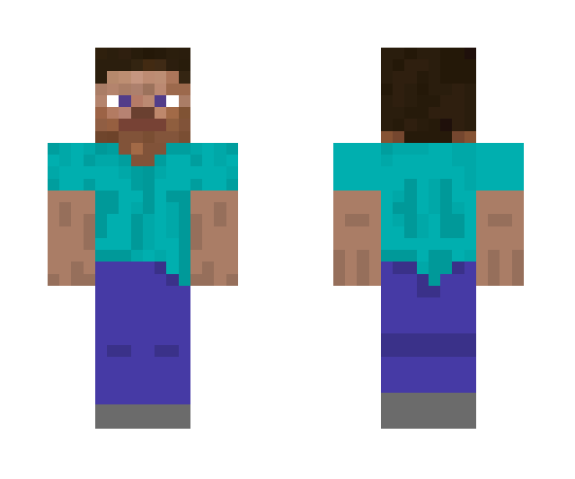

MineSkin
==

A gem to manipulate Minecraft skins [WIP]

Currently its only features are extracting skin data and rendering 2D previews

Installation
--
`gem install mineskin`

Usage
--

```ruby
require 'mineskin'
data = MineSkin::SkinData("my_skin.png")
data.head # => #<MineSkin::Cuboid ... >
data.head.top # => #<MineSkin::Texture ... >
data.head.top.texture # => #<Magick::Image ... >
data.head.top.overlay # => Magick::Image or nil

preview = MineSkin::Preview::Preview2D(data)
# background is white by default
image = preview.render(640, background: 'white') # => Magick::Image
image.format = "png"
File.open("output.png","w"){ |f| f.write image.to_blob }
```

Example of output.png:


